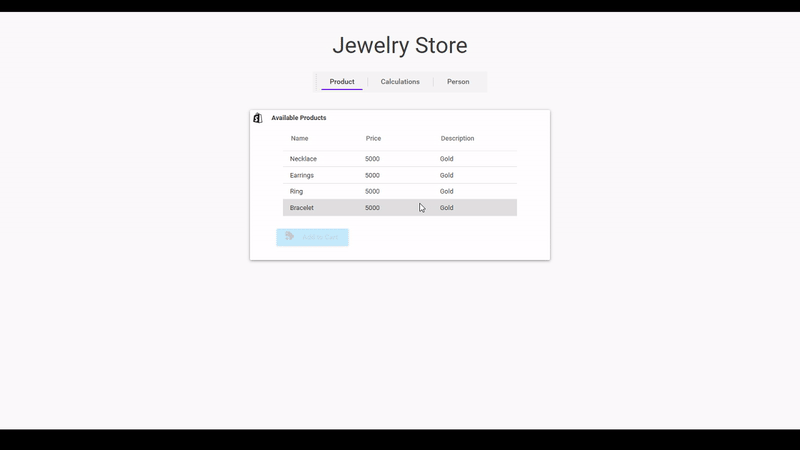

# Tax Calculator
WPF Application | Tax Excel User Interface | Caliburn Micro

**Has 2 main Commands, these are OpenExcelFilePathDialogCommand & CalculateTaxCommand**

## OpenExcelFilePathDialogCommand
### Procedure:
	Open file dialog with restriction to Excel files
	Calls ExcelDataReader functions to read excel contents and sheets.
	Calls function RowsToTaxClassCommand(); which makes a class for every row, and its properties is the row's columns.
		this function is very specific, it needs Excel file with proper format in its cells for it to convert it to classes. You can use the Excel file located in the Items folder.
	Sets SelectedExcelSheet default to Sheet 1.
***
### Expected Output:
		Program should output Excel sheet into a Datagrid. ComboBox should be updated to highlight the first Sheet's name.
		User can add any Excel file, but the calculate button won't be activated if not the Excel file from the Items Folder.
		User can choose in the combobox what Sheet to display, and Datagrid would update accordingly.
***
## CalculateTaxCommand
### Condition:
		Is enabled if the excel file has exactly 4 columns, in which the Excel file in Items folder uses as format.
***
### Procedure:
		Clears the Tax class collection
		Creates a tax class from all the rows of the datagrid
		Calls the method TaxRangeChecker, which checks the person's Basic salary and find its appropriate range in the tax class.
		After finding its respective Tax Class, Calls the method SalaryDeduction to calculate the proper Income Tax
***
### Expected Output:
		When calculate button is clicked, it would show the income tax one must pay with respect to the type of tax table chosen in the datagrid.
			Example: Person with 250,000 basic salary.
					 After uploading the	"Daily_Weekly_Monthly_Annual_Withholding_Tax.xlsx from the Items folder", Sheets would automatically be highlighted to Sheet 1, which is named Daily.
					 If you click Calculate, the program would then interpet that the user's Basic Salary of 250,000 as its Daily salary, thus incurring a daily income tax of 86431.44
					 But if the user chose the "Yearly" item in the sheets combobox, the program would then interpet that the user's Basic Salary of 250,000 as its Yearly Salary, thus incurring 0 income tax.
		Therefore it is important to choose the appropriate Tax Table for the desired Income Tax.
***			
## How to run:
* Download zip
* Extract folder
* Open OOP_Project.sln
* Clean & Rebuild Solution
* Refresh the folder and go to Bin -> Debug -> OOP_Project.exe
* Click the Calculations Button/Tab
* Click Upload Tax Table Button
* Upload "Daily_Weekly_Monthly_Annual_Withholding_Tax.xlsx from the Items folder", located at OOP_Project -> Items ->
* Click Calculate, gives the daily income tax
* Beside the Sheet:, Choose Yearly
* Click Calculate, gives the Yearly income tax
*//All other items in the combobox can be calculated(Daily,Weekly,Semi-monthly,Monthly & Yearly)*